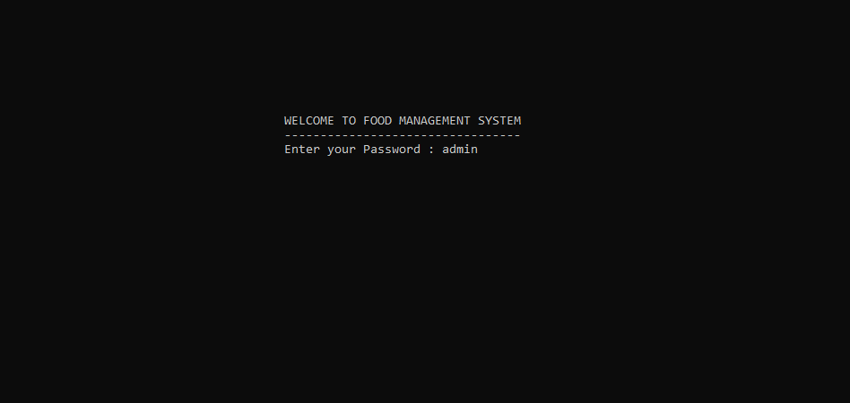
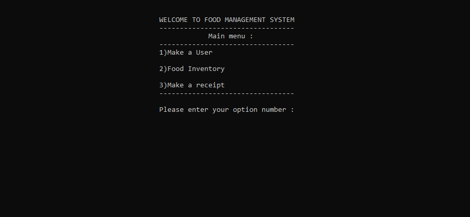
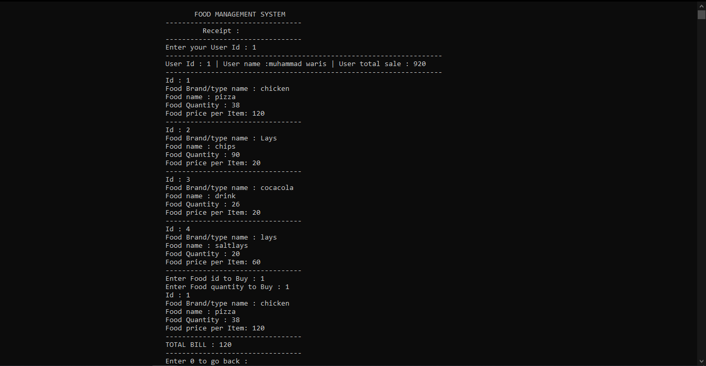
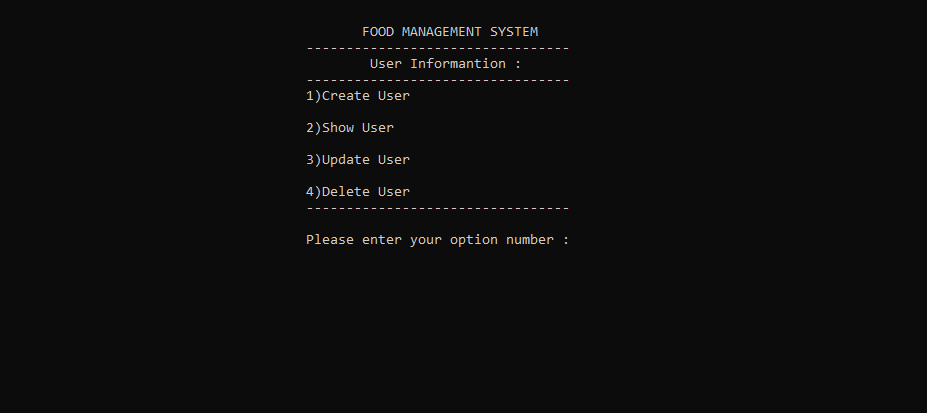
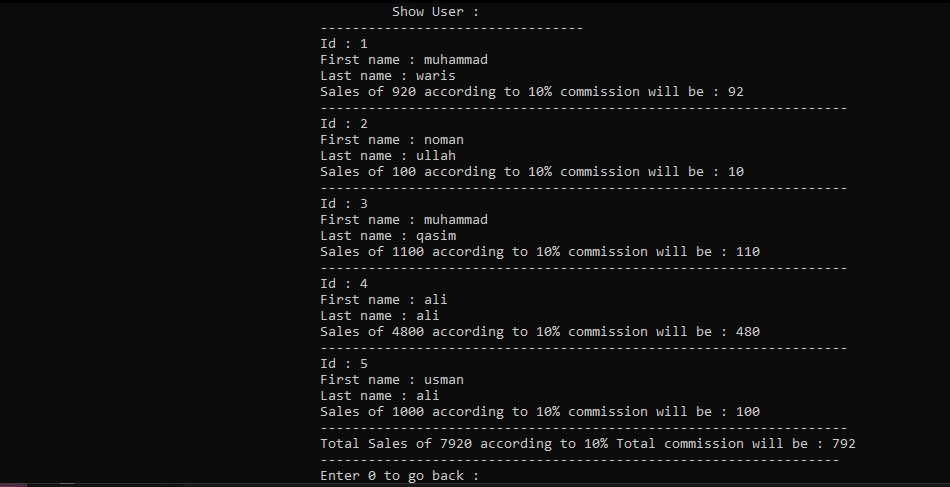
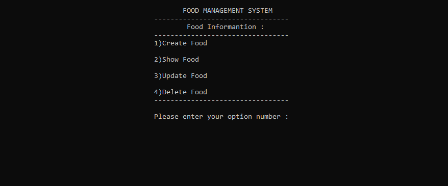
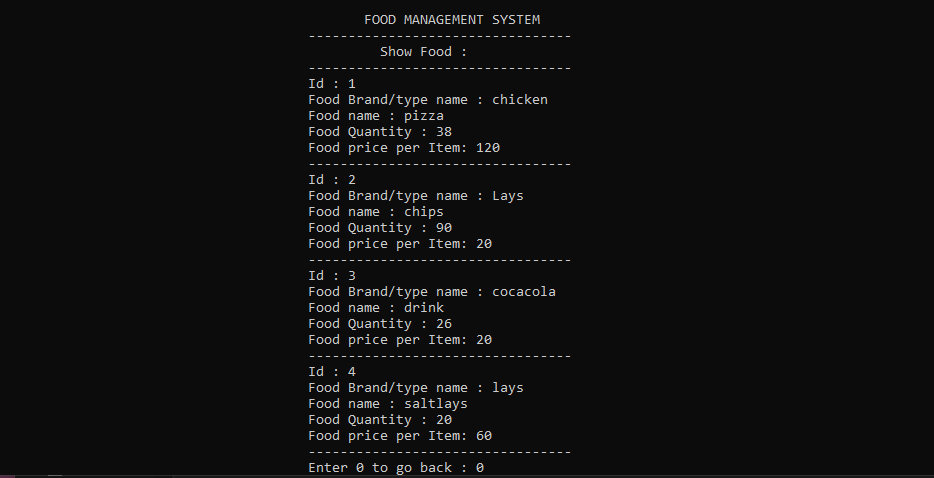

# Food Management System in C++ 👨‍🍳📊

Welcome to the Food Management System in C++! This console-based application allows you to manage users, food inventory, and create receipts for your restaurant or food business. It's a simple and efficient way to keep track of sales and food items.

## Features 🍔🍕🍣

- **User Management**: Create, view, update, and delete user profiles.
- **Food Inventory**: Add, view, update, and delete food items in your inventory.
- **Receipt Generation**: Create receipts for user purchases with automatic updates to user sales and food quantities.
- **Password Protection**: The system is password-protected to ensure data security.

## Prerequisites 🛠️

Before you can run this code, make sure you have the following installed:

- [Dev-C++](https://sourceforge.net/projects/orwelldevcpp/) (or any C++ compiler of your choice)
- A code editor (optional, but recommended)

## Installation and Usage 🚀

1. Clone or download this repository to your local machine.

```bash
git clone https://github.com/yourusername/food-management-system.git
```

2. Open the project in Dev-C++.

3. Compile and run the `main.cpp` file.

4. Follow the on-screen instructions to navigate the Food Management System.

## How to Use 📝

1. Launch the program.

2. Enter the password (default: "admin") to access the main menu.

3. Use the menu options to manage users, food items, and generate receipts.

4. Enjoy managing your food business efficiently!

## Screenshots 📸

1. Login

2. Main page

3. Receipt Generation

4. User menu

5. Users details

6. Food menu

7. Food details

## Note:warning:
You may find this project simple. Because it was my term project in OOP class.
